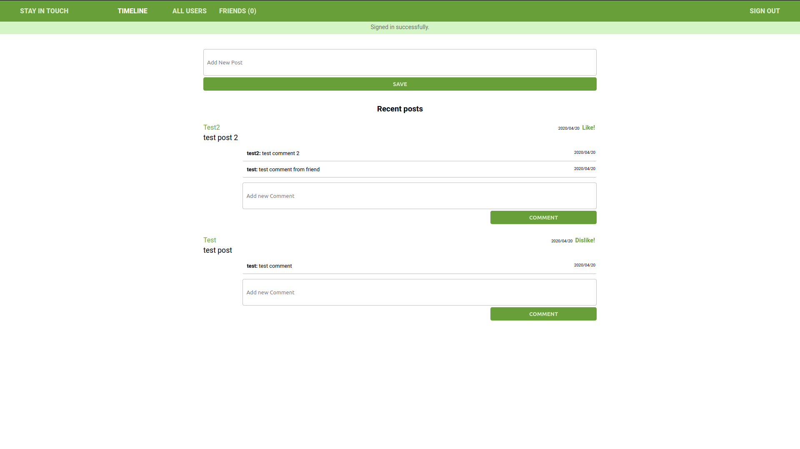

# Facebook clone

> A Facebook clone built with Ruby on Rails. This project is meant to capture some of the CRUD functionality found in Facebook.

## Features 
- User authentication (sign in, sign out, authorized routes).
- CRUD posts functionality.
- Adding and removing friends.
- Likes and dislikes.
- Friend timelines.
- Data persitence with PostgreSQL.
- Tested with RSpec.
- Unique all green color scheme (/s).
- Hosted on heroku.



## Built With

- Ruby v2.7.0
- Ruby on Rails v5.2.4
- Postgres >=9.5

## Live Demo

[Demo](https://shielded-taiga-48885.herokuapp.com)

## Getting Started

To get a local copy up and running follow these simple example steps.

### Prerequisites

Ruby: 2.6.3
Rails: 5.2.3
Postgres: >=9.5

### Setup

Instal gems with:

```
bundle install
```

Setup database with:

```
   rails db:create
   rails db:migrate
```

### Usage

Start server with:

```
    rails server
```

Open `http://localhost:3000/` in your browser.

### Run tests

Run the following in your terminal to run all tests:

```
    rpsec
```

### Deployment

Deployed to Heroku

## Authors

### Edwin Moradian | [Github](https://github.com/edwinmoradian90/) | [LinkedIn](https://linkedin.com/in/edwin-moradian) )

## 🤝 Contributing

Contributions, issues and feature requests are welcome!

Feel free to check the [issues page](issues/).

## 📝 License

MIT
# facebook-clone
